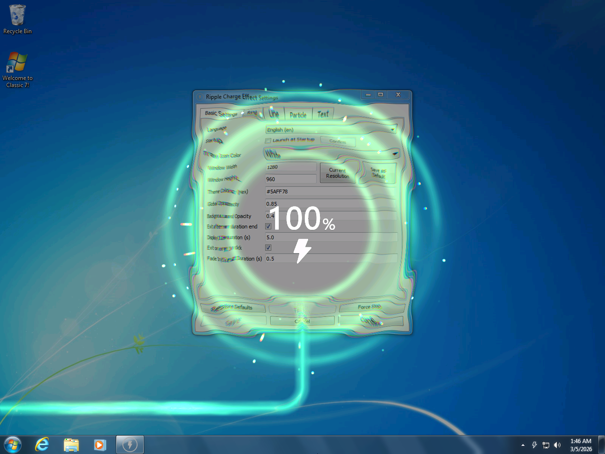

<div align="center">

# Ripple Charge Effect

<p style="font-size:20px;"><strong>水波纹充电动画</strong></p>

简体中文&nbsp;&nbsp;|&nbsp;&nbsp;[English (Trans. by LLM)](/README_en.md)

</div>

> [!NOTE]
> 本项目使用 Gemini 3 Pro 辅助开发。仅适配 Windows 平台。

## 项目介绍

灵感来源于小米 HyperOS3 充电动画。<br>
实现在 Windows 下，接入电源后显示带 `光线扭曲`、`色散` 的水波纹特效充电动画。

### 预览



## 实现功能

- [x] 实时计算动效
- [x] 所有关键参数可调
- [x] 首次运行自动读取屏幕分辨率并填入默认配置
- [x] 可还原默认配置，防止参数改乱
- [x] 优化各种闪黑屏（小概率还是有）
- [x] 充电线方向 6 种预设
- [x] 粒子效果，可选开启
- [x] 可选开机自启
- [x] 托盘外观&逻辑优化
- [x] 动画窗口层级处理
- [x] 启动效率优化
- [x] i18n
- [x] More......


## 使用方法

前往 [Releases](https://github.com/MrBocchi/RippleChargeEffect/releases) 下载。


## 自行编译

> Windows。仅供参考。

```powershell
# 创建虚拟环境
python -m venv venv

# 激活虚拟环境
.\venv\Scripts\Activate.ps1

# 安装必要依赖
pip install -r requirements.txt
pip install pyinstaller

# 执行打包命令
pyinstaller -F --noconsole --icon "assets/app.ico" --version-file "build/version_info_RippleChargeEffect.txt" RippleChargeEffect.py
```

可执行文件目录下必要依赖文件：

```text
shader.glsl
config-default.json
assets/lightning.png
assets/app.ico
assets/tray_b.ico
assets/tray_w.ico
languages/zh-CN.json
languages/en.json
```